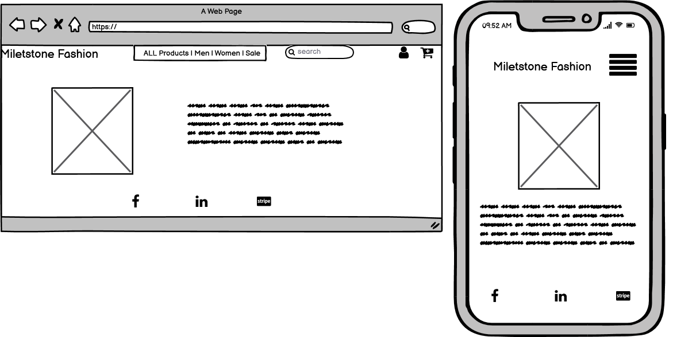
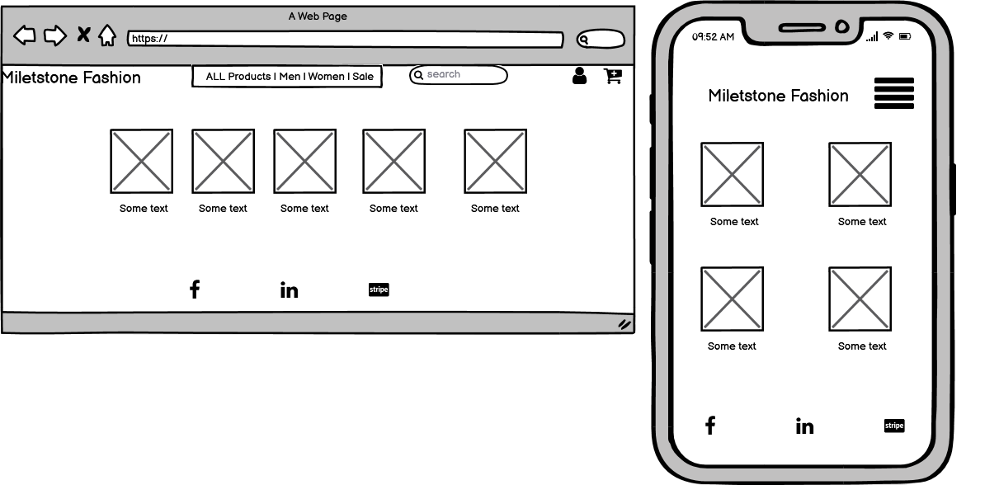
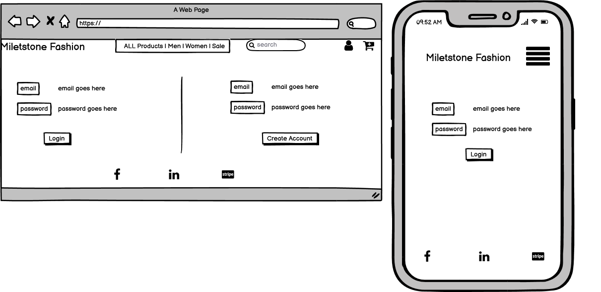

# Milestone Fashion

### [Live Site]()

Milestone Fashion is a fashion website where user can buy the latest clothes. The clothes advertised are not from know designers neither high end fashion clothes,
just a simple place where everyone can browse and just buy their favourite piece of clothe with no regret.

## Table of Contents:
-  [UX](#ux)
    -  [User Stories](#user-stories)
    -  [Strategy](#1-strategy)
    -  [Scope](#2-scope)
    -  [Structure](#3-structure)
    -  [Skeleton](#4-skeleton)
    -  [Surface](#5-surface)
-  [Features](#features)
    -  [Existing Features](#existing-features)
    -  [Features to consider implementing in the future](#features-to-consider-implementing-in-the-future)
-  [Technologies Used](#technologies-used)
    -  [Languages](#1-languages)
    -  [Integrations](#2-integrations)
    -  [Workspace, Version Control, and Repository Storage](#3-workspace-version-control-and-repository-storage)
-  [Resources](#resources)
-  [Testing](#testing)
-  [Deployment](#deployment)
-  [Credits](#credits)
-  [Acknowledgments](#acknowledgments)

## UX
### User Stories

- As a non-member, I want to visit the homepage to have an overview of what the site is about and the pricing page to check the prices.

- As a user, I want to easily understand the main purpose of the website so that I immediately know what the site is intended for upon entering.

- As a user, I want to be able to view the site on any device I may have, (mobile/tablet/desktop).

- As a user, I want to easily sign up to the website.

- As a user, I want to easily log in and log out on my account.

- As a user, I want to contact the website management to clarify doubts.

- As an admin/superuser, I want to recieve a confirmation email when a contact form is submitted.

- As an admin/superuser, I want to have the ability to update site content.

### 1. Strategy

The main strategy of this project is to promote the sale of clothing there will be a several category selection and the user can browse straight away to the category that he/she wished to make a purchase

####  Site Goals

- Provide an easy navigation website.

- Give a way to users easily chose clothing and checkout.

- Offer easy interaction on the page.

### 2. Scope

- Fits in with my current skill-set of HTML, CSS, JavaScript, Python and Django.

- Website information clearly relayed upon entering the home page.

- Easy way to Sign Up, Log in and Log out.

- Allow admin create, read, update and delete products.

### 3. Structure

The idea of the website is simple. Allow the user to buy a product and safely checkout.

The website has the same design to keep consistency and provide easy and friendly navigation to the user.

A clear communication is provided to the user after some interactions, using the messages function in Django.

### 4. Skeleton
-  Wireframes

    Homepage
    


    Product Category page
    


    Login
    


- Navigation bar - Menu with links pointing to each page
    - **Home** 
    - **Cart** -  Provide details of the purchase.
    - **Checkout** - Users can check a purchase summary and are invited to enter their delivery and payment details.
    - **Men** - Men selection
    - **Women** - Women selection
    - **Sale** - Selection of products on Sale

### Database Schema

### 5. Surface

The overall UX is clean and similar on all pages to keep consistency.

### Colors:

### Typography :

### Images:

## Features

### Existing Features


## Technologies Used
### 1. Languages

-  [HTML5](https://en.wikipedia.org/wiki/HTML5)

-  [CSS](https://en.wikipedia.org/wiki/CSS)

-  [JavaScript](https://en.wikipedia.org/wiki/JavaScript)

-  [Python](<https://en.wikipedia.org/wiki/Python_(programming_language)>)

### 2. Integrations
-  [Google Fonts](https://fonts.google.com/) - Typography.

-  [Bootstrap](https://getbootstrap.com/) - Used for icons.

-  [jQuery](https://jquery.com/) - JavaScript library.

-  [Django](https://www.djangoproject.com/) - Micro web framework written in Python.

### 3. Workspace, version control, and repository storage
-  [Gitpod](https://www.gitpod.io/) - IDE (Integrated Development Environment) used to write the code.

-  [GitHub](https://github.com/) - Repository hosting service to host the deployed website and track previous versions of code.

-  [Git](https://git-scm.com/) - Version control tool to record changes and updates to my files.

-  [Heroku](https://www.heroku.com/) - Container-based cloud platform for deployment and running of apps.

-  [AWS S3](https://aws.amazon.com/s3/) - Cloud storage for static and media files.

## Code Validation

-  [W3C](https://validator.w3.org/) - HTML Markup Validation.

-  [Closing Tag Checker for HTML5](https://www.aliciaramirez.com/closing-tags-checker/) - Validates all tags are opening and closing correctly.

-  [W3C](https://jigsaw.w3.org/css-validator/) - CSS Validation.

-  [JSHINT](https://jshint.com/) - JavaScript code warning & error check.

## Testing

## Deployment

### Project Creation
- To create this project the used the [CI Gitpod Full Template](https://github.com/Code-Institute-Org/gitpod-full-template).
- I was then directed to the create a new repository from the template page and entered in my desired repository name, then clicked create
repository.
- Once created, I navigated to my new repository on GitHub and clicked the Gitpod button which built my workspace.

### Local Installation
1. Save a copy of the GitHub [repository](https://github.com/Henriqueperoni/MS4-Read-More-For-Less) by clicking the `download.zip` button at the top of the page 
and extracting the zip file, or you clone the repository with this command:
```
$ git clone https://github.com/NunoCos/fashion-milestone4.git
```
2. Copy the repository into your IDE.
3. Install all required modules with the command:
```
pip3 install -r requirements.txt
```
4. Store your environment variables and save them in the `Environment Variables-Settings` in your IDE:
```
DEVELOPMENT - Set to True
SECRET_KEY - From a free Django Secret Key Generator
STRIPE_PUBLIC_KEY - From Developer's API on the Stripe dashboard
STRIPE_SECRET_KEY - From Developer's API on the Stripe dashboard
STRIPE_WH_SECRET - From Stripe's developer API after creating a webhook
```
5. Set up the local database running the following commands:
```
python3 manage.py makemigrations
python3 manage.py migrate
```
6. Create a superuser to access the Django Admin Panel with the command:
```
python3 manage.py createsuperuser
```
7. Start your server running the following command:
```
python3 manage.py runserver
```

### Remote Deployment on Heroku

#### Create application
1. Setup and account and log in to Heroku.
2. Click on the `new` button.
3. Select create `new app`.
4. Enter the app name.
5. Select region.
 
#### Set up connection to Github Repository:
1. Click the `Deploy tab`.
2. `Select GitHub - Connect to GitHub`.
3. A prompt to find a Github repository to connect to will be displayed.
4. Enter the repository name for the project and `Click Search`.
5. Once the repo has been found, click the `Connect Button`.

#### Set environment variables:
1. Click on the `Settings tab`.
2. Click `Reveal Config Vars`.
3. Variables added:
```
AWS_ACCESS_KEY_ID
AWS_SECRET_ACCESS_KEY
DATABASE_URL
EMAIL_HOST_PASSWORD
EMAIL_HOST_USER
SECRET_KEY
STRIPE_PUBLIC_KEY
STRIPE_SECRET_KEY
STRIPE_WH_SECRET
USE_AWS
```

#### Enable automatic deployment:
1. Click the `Deploy tab`.
2. In the Automatic Deploys section, choose the branch you want to deploy (the master branch in my Read More For Less in my case).
3. Click `Enable Automation Deploys`.

## Credits
### Resources
- [Code Institute](https://codeinstitute.net/full-stack-software-development-diploma/) Course Content - Main source of fundamental knowledge.

- Code Institute SLACK Community - General Resource.

-  [W3.CSS](https://www.w3schools.com/w3css/defaulT.asp) - General resource.

-  [Stack Overflow](https://pt.stackoverflow.com/) - General resource.

-  [Youtube](https://www.youtube.com/) - General resource.

-  [Coolors](https://coolors.co/) - Find matching color palette for site.

-  [Balsamiq](https://balsamiq.com/wireframes/) - Wireframing design tool.

-  [Google Mobile-Friendly](https://search.google.com/test/mobile-friendly) - Test Mobile-friendly check on site.

### Code

## Acknowledgments